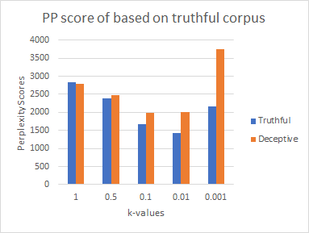
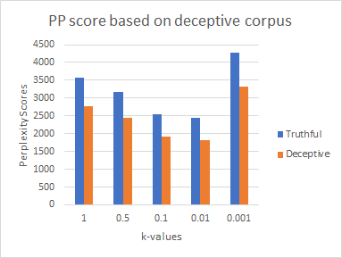
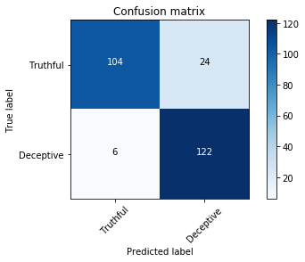
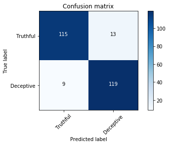

# Opinion spam detection using language modeling and Naive Bayes models

## Abstract

Language modeling and Naive Bayes classification methods are applied to model an opinion spam classifier based on given training data set. The Naive Bayes performed well with an accuracy of 92.18% and the language modeling based opinion classifier gave an accuracy of  88.28% in the validation dataset.

## Language Model

In this section we briefly describe our model. Language model can be important in many applications like machine translation, speech recognition, summarization, dialogue systems.

### Model

In this probabilistic language modeling we assign a probability to a sequence of words W (e.g. a sentence)
	p(W) = p(w1, w2, w3,.......,wn)
The we can compute the probability of the next word in a sequence as
	p(wn|w1,w2,.....,wn-1)
Let p(w1, w2, w3,.......,wn) be notated as P(w1n)

The chain rule decomposition of the above gives
P(w1n) = P(w1)P(w2|w1)P(w3|w12).....P(wn|w1n-1)
	    = ℿk=1nP(wk|w1k-1)

As per Markov assumption: 
Unigram model
p(wn|w1n-1 ) = p(wn)

Bigram model
p(wn|w1n-1 ) = p(wn|wn-1)

For our project we are considering only Unigram and the Bigram models to train on the given dataset and the performance is evaluated.

## Description and Implementation Details

In this section, we report our implementation approach. We performed preprocessing, used the training dataset to train our language model and validated it against the validation dataset provided. Then we ran our trained language model on the test set and exported the result in the csv format. The steps and results obtained are explained below. 

### Preprocessing

For tokenization, following steps are considered. 
1.	We added < s> plus space to the beginning of each review.
2.	We realized that certain words with apostrophes have space preceding the apostrophe. For example “were n’t”. We realized that this helps in our favor as we are capturing two words and thereby a meaning that it conveys. Also, there will be more unigrams with the primary words.
3.	All the text fields are converted to lowercase letters so that duplication can be avoided in tokenization. 
4.	We have tried removing stop words from default NLTK stopwords library and checked the performance on the validation set.
5.	We used both lemmatization and stemming with the help of NLTK libraries. Lemmatization helped boost our test accuracy while stemming decreased. We suspect lemmatization is working better since it preserves a valid word form taking into account the context. Stemming on the the hand have pre-fixed root words.

### Unigram Count

Unigram count is a count of all word types in the entire corpus. We defined a function “unigram(corpus)” to return a dictionary “unigram_count” for a given “corpus”. The dictionary consists of word types as keys and their count as the corresponding values. For this implementation first we create an empty dictionary, then we read the corpus by item and add them to the dictionary. Value 1 is assigned for the item if it appears for the first time, in case the item is repeated we add 1 to the existing value. 

### Bigram Count

Bigram count is a count of two consecutive words occurrences one after the other and their repetition in the entire corpus. We defined a function “bigram(corpus)” to return a dictionary “bigram_count” for a given “corpus”. The dictionary consists of bigrams as keys and their repetition as the corresponding values. For this implementation first we create an empty dictionary, then we will read the corpus by item (two words in order) and add them to the dictionary. Value is 1 is assigned for the item if it appears for the first time, in case the item is repeated we will add 1 to the existing value. 

### Smoothing and UNK words

We applied +1 smoothing for unigram perplexity calculations and +k smoothing for bigram perplexity calculations. Fig 1 shows the parameter tuning on values of k. We used k=0.01 as the optimal value as it showed the lowest perplexity.

We incorporated UNK words in our language model by placing UNK in the training corpus (truthful and deceptive) with a probability of 0.01 for every word we see in the corpus. In other words, we scanned every word of training corpus and replaced it with UNK with a coin toss probability of 0.01. This essentially means 1% of the entire training corpus will have the UNK word.  Following this, we scanned through our validation and test corpus for words that are not present the training corpus and replaced those words with UNK.  

### Perplexity

Perplexity is an intrinsic evaluation method for evaluating n-gram in language modelling. 
Perplexity is measured as below
For a test set W = w1 w2 ….. wN
	PP(W) = P (w1 w2 ….. wN)-1/N
The higher the (estimated) probability of the word sequence, the lower the perplexity. We calculated two perplexity scores for every review in the training and validation set and then assigned a label to that review based on the lower of the two perplexity scores.  

In our implementation, we calculated perplexity  in two ways:
●	Unigram Perplexity
●	Bigram Perplexity
In Unigram Perplexity we only considered unigrams in our language model and in Bigram Perplexity we only considered bigram probabilities which includes unigram counts as well. 
Results in Table 1 shows accuracies on the validation set using Unigram and Bigram perplexities. In our case, the Unigram Perplexities are giving better results. It is to be noted that in both cases, we have implemented smoothing and unknown word handling as described above.

Fig 1: Variation of k-values with Perplexity (PP) score

### Analysis of parameters:

Table 1: Language modeling parameter tuning
LC	SW	LE	ACC
(Uni)	ACC
(Bi)
0	0	0	84.76	71.48
0	0	1	85.15	72.65
0	1	0	57.81	55.47
0	1	1	59.76	58.2
1	0	0	86.32	75
1	0	1	88.28	74.2
1	1	0	62.5	62.89
1	1	1	59.37	55.86
LC: Lower Case, SW: Stopwords, LE: Lemmatizer, ACC(Uni): Accuracy of validation as per Unigram and +1 smoothing, ACC(Bi): Accuracy of validation as per Bigram and +0.01 smoothing

### Results screenshot from Kaggle:

Our prediction accuracy is 92.968% on test set as per the submission on the Kaggle for this Intrinsic Evaluation task.

## Naive Bayes Classification

Naive Bayes is a probabilistic classifier that 
makes classification using Maximum A Posteriori decision rule in a Bayesian setting. 

Naive Bayes model uses Bayes approximation and Conditional independence approximation as below:

P(x1,.....,xn) = P(x1|c).P(x2|c).P(x3|c)....P(xn|c)
where
P(xj|c) = count(word xj in training docs with label c)/count(word tokens in training docs with label c)

CMAP = argmax P
Multinomial Naive Bayes classifier is as below
CNB = argmaxc𝝐C P(cj)  ℿx𝝐X P(x|c)

### Loading the Dataset

In this approach, we worked on the same dataset consisting of truthful and deceptive hotel reviews of 20 Chicago hotels. We used file open to load reviews in a list and corresponding labels in another list. We kept a concatenated list of all the reviews combining the truthful and deceptive sets. We assigned 0 for truthful and 1 for deceptive.

### Motivation of feature choices

To apply machine learning models on the text documents, we first need to convert the text content into numerical feature vectors. An intuitive way of doing this is to implement using bag-of-words representation. In this approach, each word occurring in any document of the training set is assigned an id. For each training example, we count the occurence of word in it. Here, most counts would be zero and thus it is generally a high dimensional sparse dataset. Instead, we can save the space by storing only the non-zero parts of the feature vectors.

We tested different values of smoothing parameter(alpha) on the validation set and came up with an optimal value of 1. We also tested with both unigrams and bigram representation in the CountVectorizer and found that a combination of unigram and bigram representation performed better. In the CountVectorizer, we tested with both removing and using stopwords, and found that the former approach increase the accuracy. 

## CountVectorizer

In our project, we implemented CountVectorizer to convert the text into feature vector which a machine learning model can understand. CountVectorizer builds a dictionary of features and converts the input text into feature vectors. It includes text preprocessing, tokenizing and stop-word removal. 

## Training a Classifier

After feature extraction, we can train a machine learning model to predict the review’s authenticity. In Naive Bayes, there are several variants but we chose MultinomialNB since it is more suited for word counts which we are using. We trained the model on the training dataset and validated results from the validation set. Thereafter, we predicted the labels of the test set and exported the result in the csv format. 

## Analysis of Parameters

We evaluated our performance on the validation dataset initially. From the trained classifier, we got the predicted labels. The best accuracy we got on the validation set is 92.18% with using unigram and bigram feature matrix and stop words removing. Table 2 contains results with different parameter tuning on our validation set.

Table 2: Naive Bayes model parameter tuning
LC	SW	LE	ACC
(Bi)	ACC
(Uni)
0	0	0	90.23	91.4
0	0	1	89.8	91.4
0	1	0	91.4	91.01
0	1	1	91.01	92.18
1	0	0	90.23	91.4
1	0	1	90.6	92.18
1	1	0	91.4	91.01
1	1	1	92.18	92.18
LC: Lower Case, SW: Stopwords, LE: Lemmatizer, ACC(Uni): Accuracy of validation as per Unigram and +1 smoothing, ACC(Bi): Accuracy of validation as per Bigram and +0.01 smoothing

The best accuracy(92.18%) we got on the validation set is when we convert corpus to lowercase, remove stop words, implement lemmatization and with smoothing parameter=1.

## Results screenshot from Kaggle:

Our prediction accuracy is 89.843% on the test set as per the submission on the Kaggle.

## Error Analysis and Comparison

For the purpose of analysis and comparison, we selected two reviews, one that was classified corrected by one classifier but not by the other one and vice versa. Further, we tried to reason out why that was the case.

For this classification we used the following parameters for the two models:
●	Language Model: we used Unigram Perplexity, lowercase, lemmatization.
●	Naive Bayes: we used Unigram + Bigram feature matrix, lowercase, lemmatization, stop words removal

Review 49 (Truthful review): “my husband and…………………………………………... stay here”,

The above review was classified correctly by Naive Bayes classifier and not by the Language Model. We suspect that incorporating unigrams and bigrams in the feature matrix worked to our advantage as there were more number of features. Our LM had only unigrams.
Also we found that there were many stop words in this review and hence, removing them in NB gave the correct result.  

Review 150 (Deceptive review): “I’ve stayed at……………………………………..found my favorite”

The above review was classified correctly by Language model and not by the Naive Bayes model.
We suspect that LM worked better in this case maybe because the bigrams present in this review were not present in the training corpus hence the overall score was not as high as the unigram case. In LM model we used unigrams to run this classification and in Naive Bayes we used bigrams. Hence, LM model performed better for this review comparatively.

Moreover, we also implemented confusion matrices for both the classifiers as a comparative study. Fig 2 and 3 shows the confusion matrices.

 
Fig 2: Confusion matrix for Language Model

Fig 3: Confusion matrix for Naive Bayes

### Details of Programming library usage

Following list of programming libraries are used.
1) Pandas: for dataframes and also to export the results to csv
2) Numpy: used for arrays, matrix
Math: used to calculate log values for perplexity etc.
3) MultinomialNB from sklearn.naive_bayes
To implement naive bayes model on the given dataset
4)CountVectorizer from sklearn.feature_extraction.text
It converts a collection of text documents to a matrix of token counts
4)TfidTransformer from sklearn.feature_extraction.text
Transform a count matrix to a normalized tf or tf-idf representation
5) accuracy_score from sklearn.metrics used to find the accuracy of the validation set.
6) stopwords from nltk.corpus
used to remove stop-words from the corpus to improve the accuracy of the model

### References

[1]https://scikit-learn.org/stable/modules/generated/sklearn.naive_bayes.MultinomialNB.html
[2]https://medium.com/@rnbrown/more-nlp-with-sklearns-countvectorizer-add577a0b8c8
[3]https://towardsdatascience.com/stemming-lemmatization-what-ba782b7c0bd8

